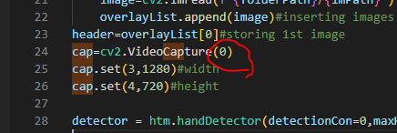

# VirtualPainter
Virtual Painter in python using autopy

## Introduction

  This project enables users to digitally paint with their fingertips in the air. It is being created in Python 3.10 with MediaPipe and OpenCV. Here is the output.
  
  
  
  
### How to run this code?

**Step 1:** Create a directory in your local machine and cd into it

```
mkdir ~/Desktop/opencv_project
cd ~/Desktop/opencv_project
```

**Step 2:** Clone the repository and cd into the folder:

```
git clone https://github.com/Kenmanekoma/VirtualPainter.git
```
**Step 3:** Install all required libraries, some of which I had to do so as follows:
```
pip install opencv-python


pip install mediapipe
```
**Step 4:** Make sure you have your video devices connected (e.g. Webcam, FaceTime HD Camera, etc.). Note: if you have multiple camera, you can change the value in  
code. (0) zero is the default camera.

    
     

**Step 5:** To run this code, simple press F5 OR use this command:
```
python VirtualPainter.py
```

**Step 6:** Enjoy :)

     
